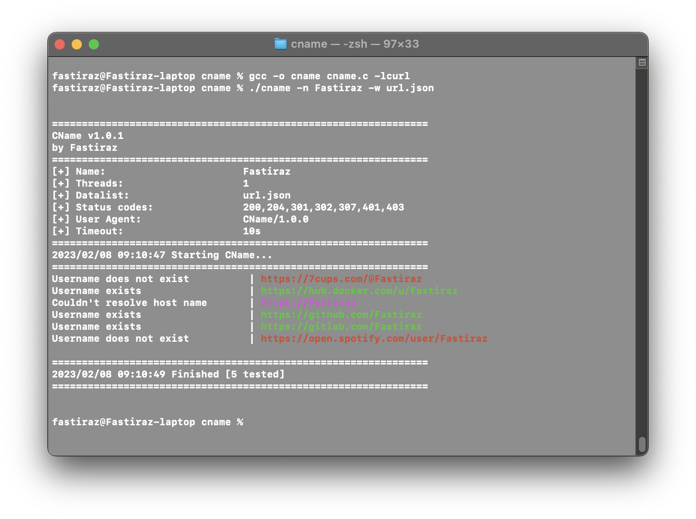

# CName

---

This is a source code written in C for a simple command line tool called "CName". The tool allows the user to find usernames across social networks. It uses libcurl to perform HTTP requests to check if a given URL is valid. The user can specify the name to search for using the -n option and the data file to read URLs from using the -w option. The data file is expected to contain URLs in the format https://www.<network_name>.com/<username>. The tool prints information about the search parameters, and then loops through the URLs in the data file, replacing the <username> part with the specified name and checking if the resulting URL returns a valid HTTP status code.

---

```txt
Compilation : gcc -o cname cname.c -lcurl
Usage : ./cname -n `username` -w `json file`
```

